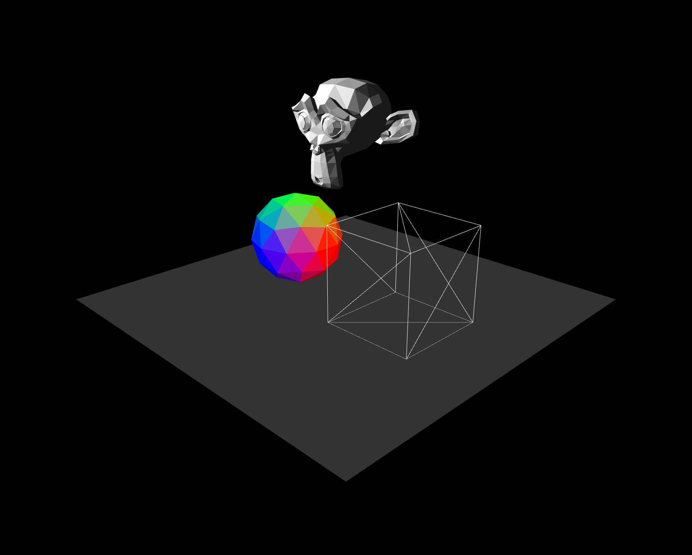

# Luces y Materiales 💡 🧱

  

### Uso 💻

Para correr el código, seguir las instrucciones de la sección **Usando los ejemplos** del repo [Recursos](https://github.com/computacion-grafica-uns/Recursos).
